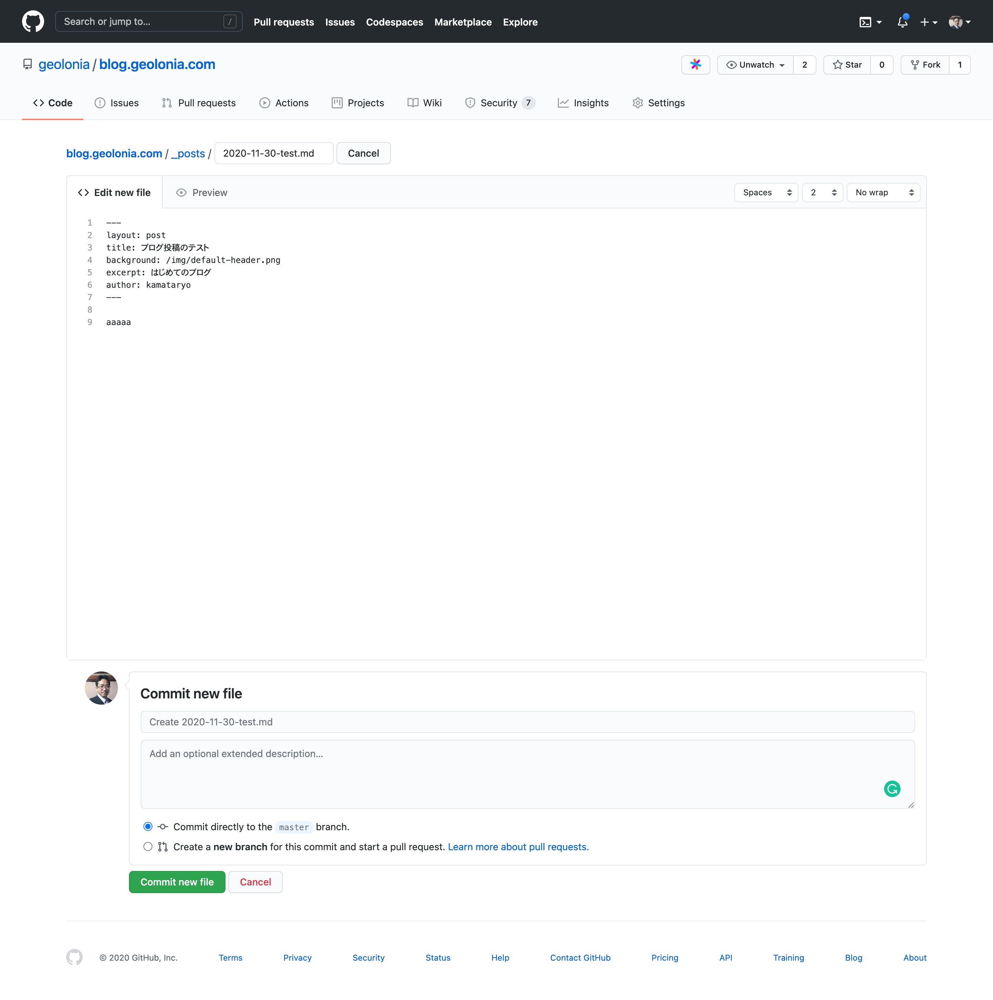

# blog.geolonia.com

## ブログの投稿方法

### はじめに

[blog.geolonia.com](https://blog.geolonia.com) は [Jekyll](https://jekyllrb.com/) という静的ウェブサイトのジェネレーターを使って生成されています。
また、ファイルの配信は [Netlify](https://www.netlify.com/) というサービスを用いています。
新しい投稿や画像の追加、記事の修正などを元データに反映して GitHub に変更をプッシュすると、HTML を含むブログの静的ファイル一式が自動的にサーバー上で生成されサイトが更新される仕組みになっています。

### ファイル構成のルール

以下のディレクトリにマークダウン形式のテキストファイルまたは画像ファイルを追加することで記事や固定ページを追加できます。

| ディレクトリ | 内容     |
| :------------- | :------------- |
| [`_posts`](https://github.com/geolonia/blog.geolonia.com/tree/master/_posts)| 個別のブログ記事のマークダウンファイルを格納する       |
| [`_pages`](https://github.com/geolonia/blog.geolonia.com/tree/master/_pages)| 個別の固定ページのマークダウンファイルを格納する       |
| [`img`](https://github.com/geolonia/blog.geolonia.com/tree/master/img)| 画像ファイルを格納する。ファイルは、 各マークダウンのファイルから絶対パス（例: `/img/image.jpg`) でアクセスできる |

### GitHub の UI からファイルを追加する

ファイルのアップロード、またはブラウザ上のテキストエディタを使ってファイルを追加することができます。当プロジェクトに書き込み権限がない場合は、プロジェクトをフォークすることで同じ操作が可能です。

[テキストエディタを使ってブログ投稿を追加する](https://github.com/geolonia/blog.geolonia.com/new/master/_posts)



ページ下部の `Commit new file` に表示されているフォームにタイトルや概要を入力することで、今回のブログ投稿に関する変更履歴を Git の機能で記録することができます。

レビューなしでブログを更新する場合は `Commit directly to master branch.` を、プルリクエストのレビュー機能を使う場合は `Create a new branch for this commit and start a pull request.` を選択して任意のブランチ名を指定してください。

### デプロイプレビューを活用する

プルリクエストのレビューの際にデプロイプレビューを利用できます。これは、プレビュー用の URL を発行してプルリクエストがマージされた状態でのウェブサイトを作成し、目視でのレビューを実現するための機能です。master ブランチに対するプルリクエストを作成すると Netlify によって自動的に作成されます。


GitHub のプルリクエストのページにデプロイプレビューのステータスが表示されます。ステータスが `Deploy preview ready!` になった後でリンクをクリックするとデプロイプレビューにアクセスできます。プルリクエストのレビュワーはこの一時的なウェブサイトにアクセスして表示を確認しながらレビューを進めることができます。

## Advanced

```
$ bundle install --path vendor
$ bundle exec jekyll serve
```

---


[Clean Blog Jekyll](http://startbootstrap.com/template-overviews/clean-blog-jekyll/) is a stylish, responsive blog theme for [Bootstrap](http://getbootstrap.com/) created by [Start Bootstrap](http://startbootstrap.com/). This theme features a blog homepage, about page, contact page, and an example post page along with a working contact form powered by [Formspree](https://formspree.io/).

This repository holds the official Jekyll version of the Clean Blog theme on Start Bootstrap!

### Preview

**[View Live Preview](http://blackrockdigital.github.io/startbootstrap-clean-blog-jekyll/)**

### Installation & Setup

#### Using RubyGems:

When installing the theme using RubyGems, demo images, posts, and pages are not included. Follow the instructions below for complete setup.

1. (Optional) Create a new Jekyll site: `jekyll new my-site`
2. Replace the current theme in your `Gemfile` with `gem "jekyll-theme-clean-blog"`.
3. Install the theme: `bundle install`
4. Replace the current theme in your `_config.yml` file with `theme: jekyll-theme-clean-blog`.
5. Build your site: `bundle exec jekyll serve`

Assuming there are no errors and the site is building properly, follow these steps next:

1. Create the following pages if they do not exist already (or change the extension of exisitig markdown files from `.md` to `.html`):
   - `index.html` - set to `layout: home`
   - `about.html` - set to `layout: page`
   - `contact.html` - set to `layout: page`
   - `posts/index.html` - set to `layout: page` (you will also need to create a `posts` directory)
2. Configure the `index.html` front matter. Example:
```
---
layout: home
background: '/PATH_TO_IMAGE'
---
```
3. Configure the `about.html`, `contact.html`, and `posts/index.html` front matter. Example:
```
---
layout: page
title: Page Title
description: This is the page description.
background: '/PATH_TO_IMAGE'
---
```
4. For each post in the `_posts` directory, update the front matter. Example:
```
---
layout: post
title: "Post Title"
subtitle: "This is the post subtitle."
date: YYYY-MM-DD HH:MM:SS
background: '/PATH_TO_IMAGE'
---
```

For reference, look at the [demo repository](https://github.com/BlackrockDigital/startbootstrap-clean-blog-jekyll) to see how the files are set up.

5. Add the form to the `contact.html` page. Add the following code to your `contact.html` page:
```
<form name="sentMessage" id="contactForm" novalidate>
  <div class="control-group">
    <div class="form-group floating-label-form-group controls">
      <label>Name</label>
      <input type="text" class="form-control" placeholder="Name" id="name" required data-validation-required-message="Please enter your name.">
      <p class="help-block text-danger"></p>
    </div>
  </div>
  <div class="control-group">
    <div class="form-group floating-label-form-group controls">
      <label>Email Address</label>
      <input type="email" class="form-control" placeholder="Email Address" id="email" required data-validation-required-message="Please enter your email address.">
      <p class="help-block text-danger"></p>
    </div>
  </div>
  <div class="control-group">
    <div class="form-group col-xs-12 floating-label-form-group controls">
      <label>Phone Number</label>
      <input type="tel" class="form-control" placeholder="Phone Number" id="phone" required data-validation-required-message="Please enter your phone number.">
      <p class="help-block text-danger"></p>
    </div>
  </div>
  <div class="control-group">
    <div class="form-group floating-label-form-group controls">
      <label>Message</label>
      <textarea rows="5" class="form-control" placeholder="Message" id="message" required data-validation-required-message="Please enter a message."></textarea>
      <p class="help-block text-danger"></p>
    </div>
  </div>
  <br>
  <div id="success"></div>
  <div class="form-group">
    <button type="submit" class="btn btn-primary" id="sendMessageButton">Send</button>
  </div>
</form>
```

Make sure you have the `email` setting in your `_config.yml` file set to a working email address! Once this is set, fill out the form and then check your email, verify the email address using the link sent to you by Formspree, and then the form will be working!

6. Build your site: `bundle exec jekyll serve`

#### Using Core Files

When using the core files, the demo images, posts, and pages are all included with the download. After following the instructions below, you can then go and change the content of the pages and posts.

1. [Download](https://github.com/BlackrockDigital/startbootstrap-clean-blog-jekyll/archive/master.zip) or Clone the repository.
2. Update the following configuration settings in your `_config.yml` file:
   - `baseurl`
   - `url`
   - `title`
   - `email` (after setting this setting to a working email address, fill out the form on the contact page and send it - then check your email and verify the address and the form will send you messages when used)
   - `description`
   - `author`
   - `twitter_username` (Optional)
   - `facebook_username` (Optional)
   - `github_username` (Optional)
   - `linkedin_username` (Optional)
3. Build your site: `bundle exec jekyll serve`

### Bugs and Issues

Have a bug or an issue with this template? [Open a new issue](https://github.com/BlackrockDigital/startbootstrap-clean-blog-jekyll/issues) here on GitHub!

### About

Start Bootstrap is an open source library of free Bootstrap templates and themes. All of the free templates and themes on Start Bootstrap are released under the MIT license, which means you can use them for any purpose, even for commercial projects.

* https://startbootstrap.com
* https://twitter.com/SBootstrap

Start Bootstrap was created by and is maintained by **[David Miller](http://davidmiller.io/)**, Owner of [Blackrock Digital](http://blackrockdigital.io/).

* http://davidmiller.io
* https://twitter.com/davidmillerskt
* https://github.com/davidtmiller

Start Bootstrap is based on the [Bootstrap](http://getbootstrap.com/) framework created by [Mark Otto](https://twitter.com/mdo) and [Jacob Thorton](https://twitter.com/fat).

### Copyright and License

Copyright 2013-2019 Blackrock Digital LLC. Code released under the [MIT](https://github.com/BlackrockDigital/startbootstrap-clean-blog-jekyll/blob/gh-pages/LICENSE) license.
